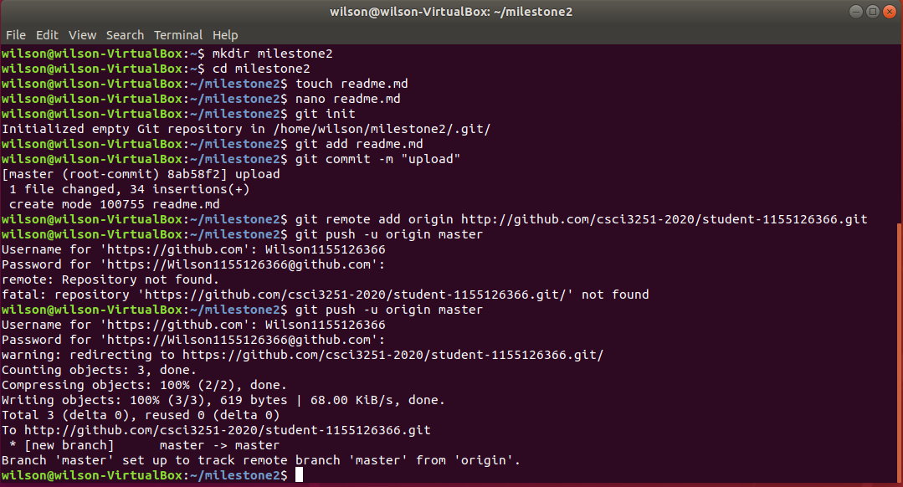

# Milestone 2 of To Yi Him 1155126366 <h1>
   
# Intro <h4>
   
*I am a IE student who is interested in CS, I reg both major this year and I do very well in sem1. I hope I can also do well in sem2 and transfer to CS next year.*

**I am new to github, it is a very good platform for programming!**

_Hope i can **learn** more in this cource!_

# Tasks <h4>

1. Header
2. Emphasis
3. List
  3.1. Task List
  3.2. Table
   
# tasks i done by now <h4>
   
- [x] Header
- [x] Emphasis
- [x] List
- [x] Task List
- [ ] Table

# Table <h4>

Engg | Difficulty | Feelings
------------ | ------------- | -------------
CS | Hard in y2 and very hard in y3 and 4 | very interesting
IE | Very hard in y2 | very boring

# Screenshot <h4>

